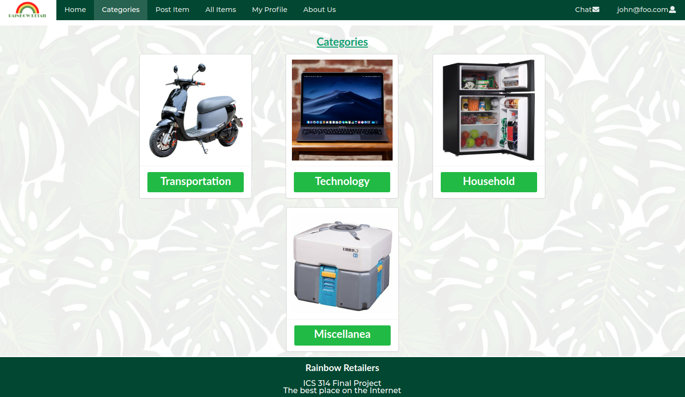
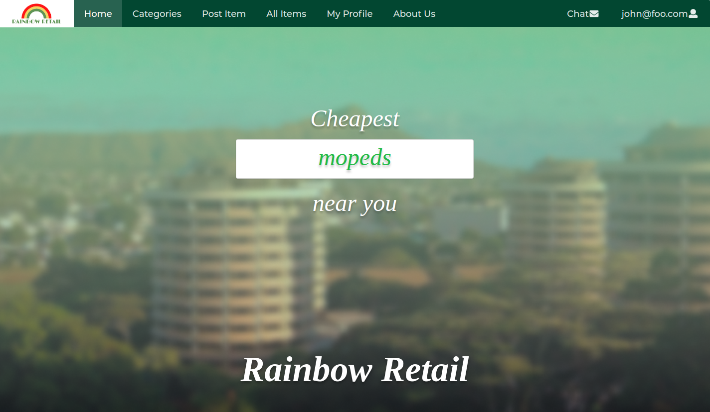

This was an idea by Professor Johnson in my ICS314 class. The idea was to create a craigslist/ebay type site made exclusively for UH students. On this website you can buy and sell with user profiles linked to UH accounts. You can then chat with them and try to bargain. I was in charge of extra features such as the I’m feeling lucky page, landing page and linking the navbar. 

For more information you can check out our project page https://renigmaflea.github.io/ . This will give you a good overview of what was accomplished.

# Difficulties

This was easily the most difficult group project I have ever worked on due to the COVID-19 virus. We had to meet up as a team, except we could not physically meet, so all group interactions were done through discord.

# Takeaways

The main thing I learned was to work with a group using github. Github is very hard to manage when communication is an issue, so we learned to communicate better. Some technical skills we learned were project management, databases and deploying the website to Galaxy. 

For the full code you can check out our organization page at https://github.com/renigmaflea/renigmaflea .

# Overall

Overall, this was a project I will never forget. The main reason is because it was such a complicated project to do during a pandemic and coordinating to work on it was very hard. However, it was a great experience and I am glad with the way it turned out.
