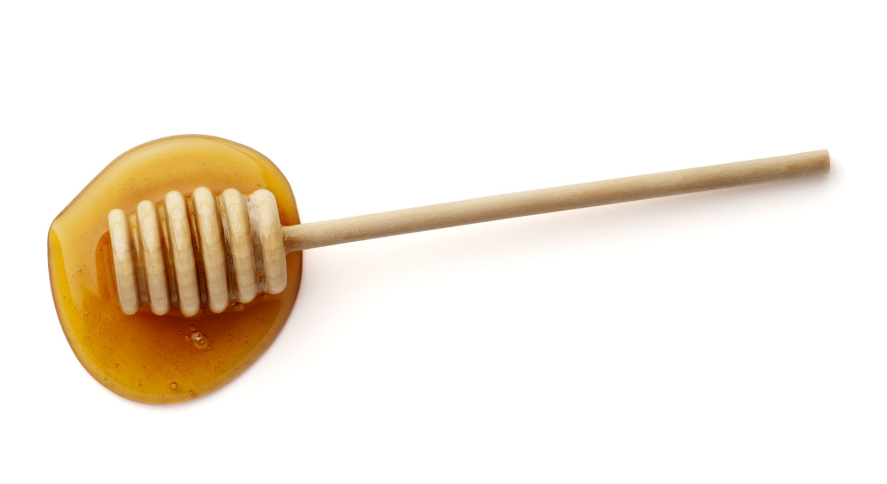

  

Graphene was known for it's incredible strength and conduction capabilities a few years ago. Today, we have realized that it is very expensive and difficult to produce. My group learned that the hard way when our project was to see if graphene would be a suitable photodetector. The short answer is: it wouldn't work and if it did work it would be too expensive. 

For my Sophomore project in engineering I was tasked with seeing if graphene using honey (as in the stuff that comes from bees) as a bridge between the P-N junction. We found through experimentation that it did not hold a charge for a long enough time, but that was not the takeaway from the experiment. My takeaway from the experiment was how to sell an idea. At the engineering fair, my team was disheartened because we wanted to do well, but our project was a big 'N' 'O'. So for sections such as future applications we had nothing. However, we still ended up placing top three at the fair simply because I convinced people to vote for my group. This was an important learning experience for me because I learned that the product you are selling does not matter as much as the way that you sell it. 

